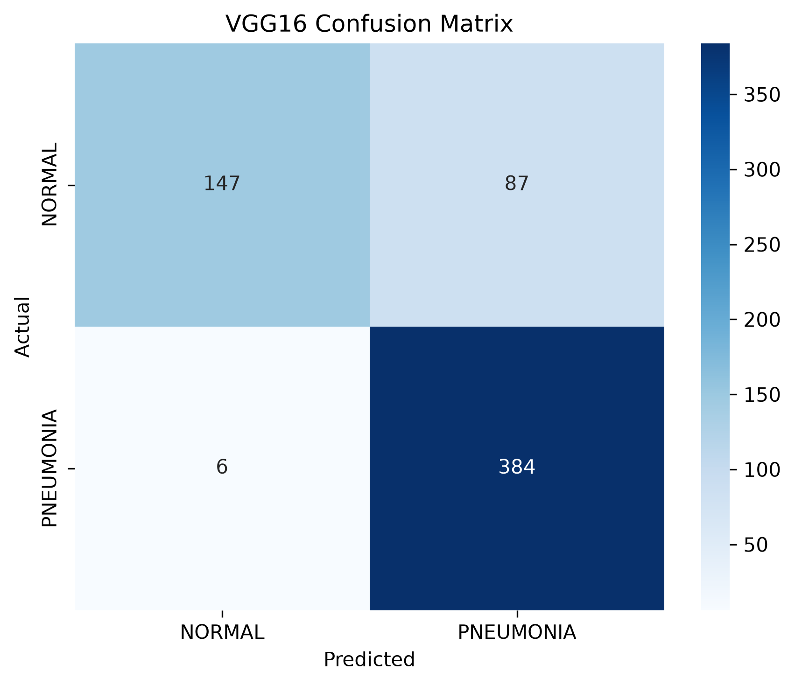
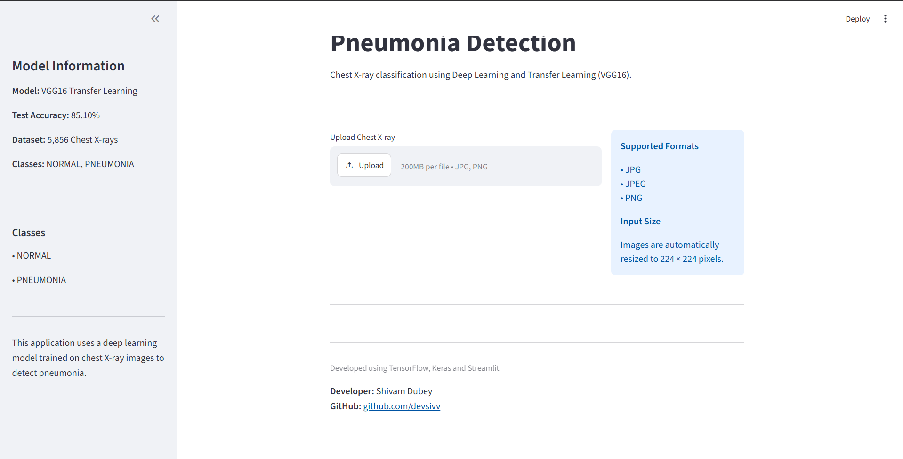
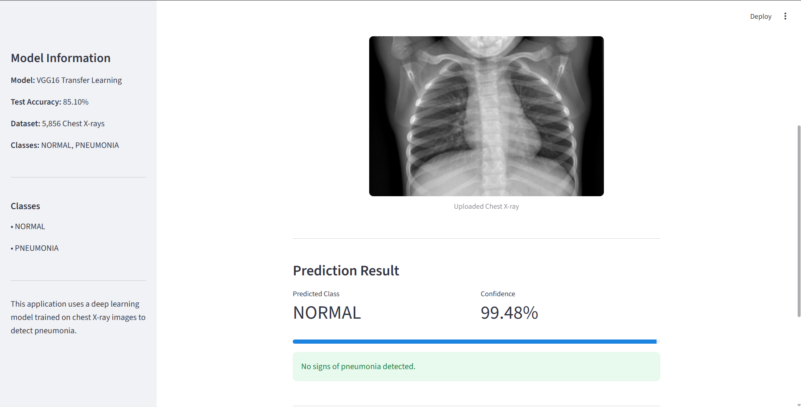
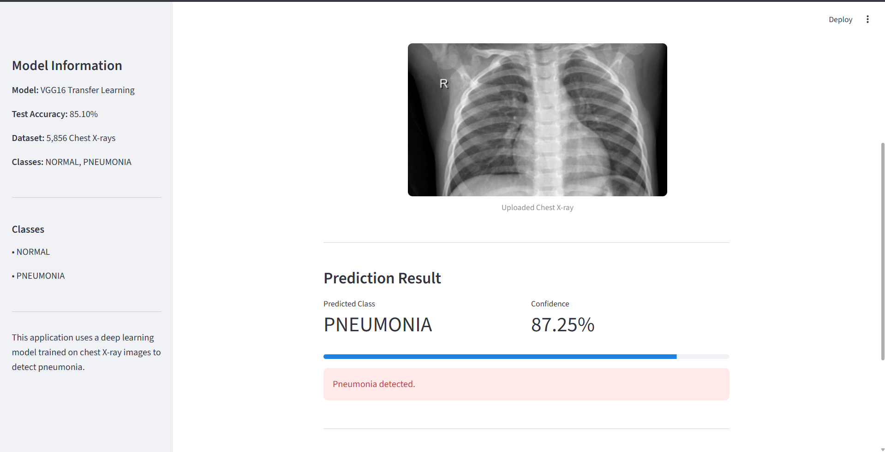
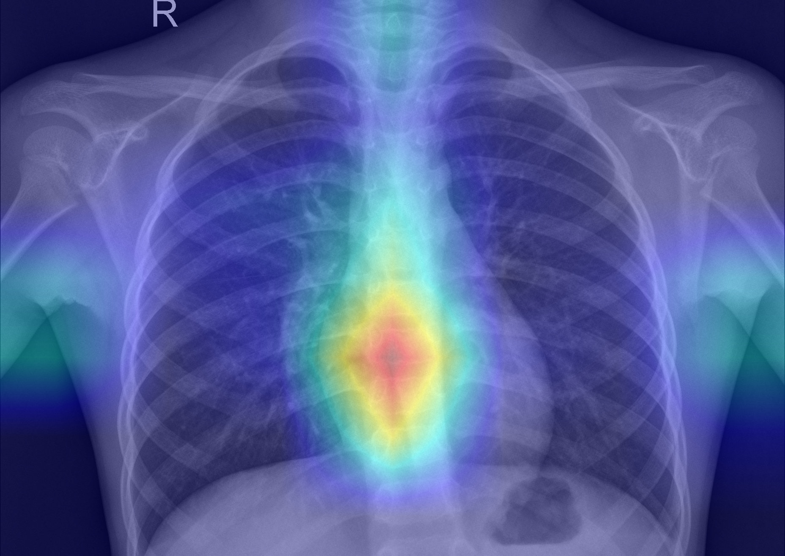
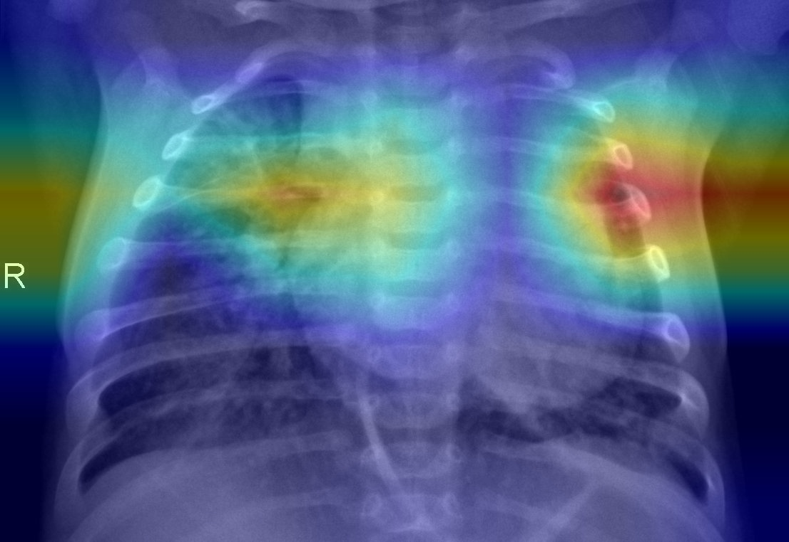

# 🩺 Pneumonia Detection Using Deep Learning

<p align="center">
  <strong>An automated deep learning image classification system for detecting pneumonia from chest X-ray radiographs, deployed as a Streamlit web application.</strong>
</p>

---


---

## 📑 Table of Contents

* [Project Overview](#-project-overview)
* [Features](#-features)
* [Dataset](#-dataset)
* [Technologies Used](#-technologies-used)
* [Project Architecture & Workflow](#-project-architecture--workflow)
* [Model Architectures](#-model-architectures)
* [Results & Performance](#-results--performance)
* [Quick Start](#-quick-start)
* [Streamlit Application](#-streamlit-application)
* [Application Screenshots](#-application-screenshots)
* [Project Structure](#-project-structure)
* [Limitations & Future Improvements](#-limitations--future-improvements)
* [Repository](#-repository)
* [Author](#-author)

---

## 🔍 Project Overview

This project leverages Deep Learning and Transfer Learning techniques to detect pneumonia from chest X-ray images.

Pneumonia is a serious respiratory infection that can lead to severe health complications if not diagnosed early. The objective of this project is to build an automated image classification system capable of identifying pneumonia from radiographic scans with high sensitivity.

The project covers the complete machine learning lifecycle:

* Data Exploration
* Data Preprocessing
* Data Augmentation
* Custom CNN Development
* Transfer Learning with VGG16
* Transfer Learning with ResNet50
* Model Evaluation
* Model Comparison
* Inference Pipeline
* Streamlit Deployment

---

## ✨ Features

* End-to-End Deep Learning Pipeline
* Custom CNN Architecture
* Transfer Learning using VGG16
* Transfer Learning using ResNet50
* Model Evaluation using Confusion Matrix and Classification Report
* Real-Time Inference on Chest X-ray Images
* Interactive Streamlit Web Application
* Grad-CAM Explainable AI Visualization
* Confidence Score Prediction
* Hugging Face Model Hosting
* Clean and Modular Project Structure


---

## 📊 Dataset

The model was trained using the **Chest X-Ray Images (Pneumonia)** dataset available on Kaggle.

**Dataset Source:**
https://www.kaggle.com/datasets/paultimothymooney/chest-xray-pneumonia

### Dataset Summary

* Total Images: **5,856**
* Classes:

  * NORMAL
  * PNEUMONIA
* Image Type: Chest X-ray (JPEG)

### Dataset Structure

```text
data/
├── train/
│   ├── NORMAL/
│   └── PNEUMONIA/
├── val/
│   ├── NORMAL/
│   └── PNEUMONIA/
└── test/
    ├── NORMAL/
    └── PNEUMONIA/
```

The dataset contains pediatric chest X-ray images categorized by expert radiologists into Normal and Pneumonia classes.

---

## 🛠️ Technologies Used

### Programming Language

* Python

### Deep Learning

* TensorFlow
* Keras

### Data Processing

* NumPy

### Visualization

* Matplotlib
* Seaborn

### Machine Learning Utilities

* Scikit-learn

### Deployment

* Streamlit

---

## ⚙️ Project Architecture & Workflow

1. Data Exploration
2. Data Preprocessing
3. Data Augmentation
4. Custom CNN Training
5. VGG16 Transfer Learning
6. ResNet50 Transfer Learning
7. Model Evaluation
8. Model Comparison
9. Inference Pipeline
10. Grad-CAM Explainable AI
11. Streamlit Deployment


---

## 🧠 Model Architectures

### Custom CNN

A baseline Convolutional Neural Network trained from scratch to establish benchmark performance.

### VGG16

Transfer Learning model utilizing ImageNet pretrained weights. VGG16 was selected as the final deployment model due to its superior performance on the test dataset.

### ResNet50

Transfer Learning model based on residual learning, capable of learning deeper feature representations.

---

## 📈 Results & Performance

The models were evaluated on the hold-out test dataset.

| Model | Test Accuracy |
| ----- | ------------- |
| VGG16 | **85.10%**    |

### VGG16 Confusion Matrix

```text
[[147  87]
 [  6 384]]
```



### Key Observations

* Pneumonia Recall ≈ 98%
* Normal Recall ≈ 63%
* High sensitivity for pneumonia detection
* Suitable as a screening support system

---

## ⚙️ Project Architecture & Workflow

1. Data Exploration
2. Data Preprocessing
3. Data Augmentation
4. Custom CNN Training
5. VGG16 Transfer Learning
6. ResNet50 Transfer Learning
7. Model Evaluation
8. Model Comparison
9. Inference Pipeline
10. Grad-CAM Explainable AI
11. Streamlit Deployment


---

## 💻 Quick Start

### 1. Clone Repository

```bash
git clone https://github.com/devsivv/Pneumonia-Detection.git
cd Pneumonia-Detection
```

### 2. Create Virtual Environment

```bash
python -m venv venv
```

### 3. Activate Environment

#### Windows

```bash
venv\Scripts\activate
```

#### Linux / macOS

```bash
source venv/bin/activate
```

### 4. Install Dependencies

```bash
pip install -r requirements.txt
```

### 5. Run Streamlit Application

```bash
python -m streamlit run streamlit_app/app.py
```

---

## 🌐 Streamlit Application

The Streamlit application enables users to:

* Upload Chest X-ray Images
* Preview Uploaded Images
* Perform Real-Time Inference
* View Model Confidence Scores
* Obtain Instant Pneumonia Detection Results
* View Prediction Confidence Scores
* Visualize Grad-CAM Explainability Heatmaps


---

## 📸 Application Screenshots

### Home Page



### Normal Prediction



### Pneumonia Prediction



### Grad-CAM Explainability

To improve transparency and interpretability, the application generates Grad-CAM (Gradient-weighted Class Activation Mapping) visualizations showing which regions of the chest X-ray contributed most to the model's prediction.

Red and yellow regions indicate stronger influence on the final classification, helping users understand where the model is focusing during inference.


 
### Model Evaluation

 

---

## 🔬 Explainable AI with Grad-CAM
Grad-CAM (Gradient-weighted Class Activation Mapping) is used to visualize the regions of a chest X-ray that contributed most to the model's prediction.

The heatmaps below highlight areas that received the highest attention from the VGG16 model during inference. Red and yellow regions indicate stronger influence on the final prediction.

#### Normal X-ray Grad-CAM



#### Pneumonia X-ray Grad-CAM




---

### Grad-CAM Interpretation

---

Grad-CAM improves model transparency by highlighting image regions that influenced the prediction.

These visualizations help verify whether the model is focusing on clinically relevant thoracic regions rather than unrelated image artifacts.

While Grad-CAM provides insight into model attention, it does not guarantee clinical correctness and should be interpreted as an explanation of model behavior rather than a definitive localization of disease.

---

## 📁 Project Structure

```text
Pneumonia-Detection/
│
├── data/
│   ├── train/
│   │   ├── NORMAL/
│   │   └── PNEUMONIA/
│   │
│   ├── val/
│   │   ├── NORMAL/
│   │   └── PNEUMONIA/
│   │
│   └── test/
│       ├── NORMAL/
│       └── PNEUMONIA/
│
├── models/
│   ├── .cache/
│   ├── custom_cnn.keras
│   ├── resnet50_finetuned.keras
│   └── vgg16_pneumonia.keras
│
├── notebooks/
│   ├── 01_data_exploration.ipynb
│   ├── 02_preprocessing.ipynb
│   ├── 03_custom_cnn.ipynb
│   ├── 04_vgg16.ipynb
│   ├── 05_resnet50.ipynb
│   ├── 06_model_comparison.ipynb
│   ├── 07_inference_pipeline.ipynb
│   ├── 08_gradcam_explainability.ipynb
│   └── 09_gradcam_v2.ipynb
│
├── reports/
│   ├── screenshots/
│   │   ├── 01_home_page.png
│   │   ├── 02_normal_prediction.png
│   │   ├── 03_pneumonia_prediction.png
│   │   └── 04_model_evaluation.png
│   │   └── 05_gradcam_prediction.png
│   │
│   └── gradcam_examples/
│       ├── gradcam_normal_1.jpg
│       ├── gradcam_normal_2.jpg
│       ├── gradcam_pneumonia_1.jpg
│       └── gradcam_pneumonia_2.jpg
│
├── streamlit_app/
│   └── app.py
│
├── .gitignore
├── .python-version
├── .runtime.txt
├── README.md
├── requirements.txt
└── main.py
```

---

## ⚠️ Limitations & Future Improvements

### Current Limitations

The dataset contains significantly more Pneumonia images than Normal images.

As a result:

* Pneumonia sensitivity is very high
* Some Normal images may be incorrectly classified as Pneumonia

### Future Improvements

* Dataset balancing techniques
* Additional data collection
* Hyperparameter optimization
* Model ensembling
* Cloud deployment

---

### Explainability Notes

Grad-CAM provides a visual explanation of model attention but does not guarantee clinical correctness.

Highlighted regions indicate areas that influenced the model's prediction rather than the exact location of disease.

The system should be considered a decision-support tool and not a substitute for expert radiological interpretation.


---

## 🔗 Live Demo

Streamlit Application:
https://chest-xray-pneumonia-detector.streamlit.app/

## 🔗 Model Repository

Hugging Face:
https://huggingface.co/devsivvHF/pneumonia-detection-models

## 🔗 GitHub Repository

https://github.com/devsivv/Pneumonia-Detection

---

## 👨‍💻 Author

**Shivam Dubey**

Deep Learning & Machine Learning Enthusiast

GitHub: https://github.com/devsivv

---

### Disclaimer

This project is intended for educational and research purposes only. It should not be used as a substitute for professional medical diagnosis or treatment.
